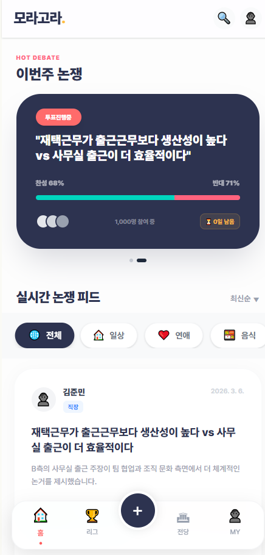
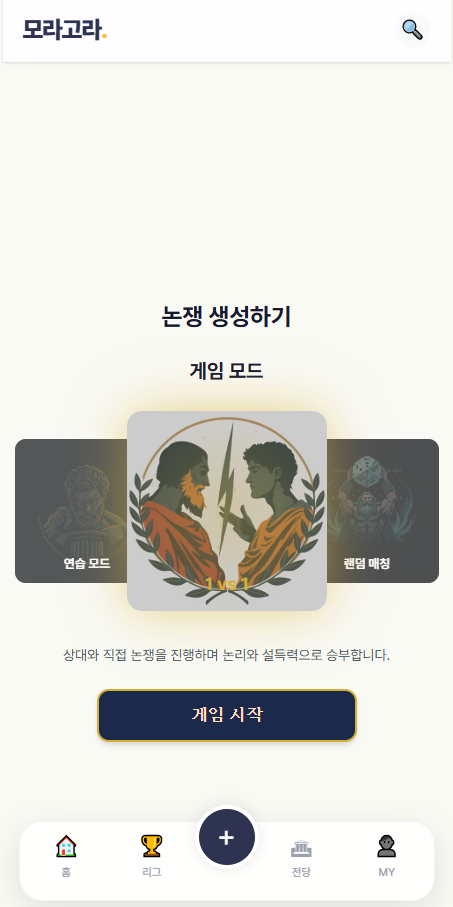
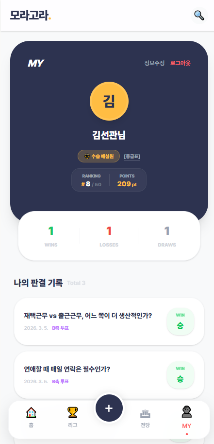

<p align="center">
  
</p>

# 모라고라 (Moragora)

AI 기반 논쟁 판결 플랫폼 — 3개 AI 모델의 병렬 판결 + 시민 배심원 투표로 공정한 결론을 도출합니다.

**배포 주소**: https://team-moragora-client.vercel.app/

## 서비스 화면

| 홈 / 논쟁 피드 | 게임 모드 선택 | 마이페이지 |
|:---:|:---:|:---:|
|  |  |  |

## 기술 스택

| 구분 | 기술 |
|------|------|
| Frontend | React 19, Vite, Tailwind CSS, React Router |
| Backend | Express.js, Node.js |
| Database | Supabase (PostgreSQL + Auth + RLS) |
| AI 판결 | GPT-4o, Gemini 2.5 Flash, Claude Sonnet (+ Grok fallback) |
| 배포 | Vercel (프론트), Render (백엔드) |

## 프로젝트 구조

```
moragora/
├── client/          # React 프론트엔드
│   ├── src/
│   │   ├── pages/         # 페이지 컴포넌트
│   │   ├── components/    # 공통 컴포넌트
│   │   ├── services/      # API, Supabase 클라이언트
│   │   └── store/         # 상태 관리 (AuthContext)
│   └── vite.config.js
├── server/          # Express 백엔드
│   ├── src/
│   │   ├── controllers/   # 요청 처리
│   │   ├── routes/        # API 라우트
│   │   ├── services/      # 비즈니스 로직 + AI 서비스
│   │   ├── middleware/     # 인증, 콘텐츠 필터
│   │   └── db/            # DB 스키마
│   └── server.js
└── package.json     # 모노레포 루트 (npm workspaces)
```

## 아키텍처

```
┌──────────────┐      ┌──────────────────┐      ┌─────────────────┐
│   React App  │ ──── │  Express Server   │ ──── │    Supabase     │
│   (Vercel)   │ JWT  │    (Render)       │      │  PostgreSQL+Auth│
└──────────────┘      └────────┬─────────┘      └─────────────────┘
                               │
                    ┌──────────┼──────────┐
                    ▼          ▼          ▼
                 GPT-4o    Gemini     Claude
                           2.5 Flash   Sonnet
```

**AI 판결 흐름**: 논쟁 완료 → 3개 AI 모델에 병렬 요청 → 각 모델이 5개 항목(논리성/근거/설득력/일관성/표현력) 채점 → 점수 합산 후 최종 판결 → 시민 투표 반영(30명 이상 시 25% 가중)

## 주요 기능

- **게임 모드 선택** — 1vs1 대전, 연습(솔로) 모드, 랜덤 매칭(예정)
- **논쟁 생성** — 주제, 목적, 관점 렌즈 설정 (3단계 위자드)
- **주장 입력** — A/B 양측 주장 작성 + 3단계 콘텐츠 필터링
- **AI 판결** — 3개 모델 병렬 판결 (논리성/근거/설득력/일관성/표현력)
- **복합 판결** — AI 3사 75% + 시민 투표 25% (30명 이상 시 반영)
- **판결문 피드** — 완료된 판결문 카드 리스트
- **마이페이지** — 전적 관리, 닉네임 수정, 티어/랭킹 확인
- **초대 공유** — 링크 기반 상대방 초대

## 팀 구성

| 이름 | 역할 | 담당 |
|------|------|------|
| 김선관 | Backend | Express + AI 판결 + 콘텐츠 방어 |
| 서우주 | Frontend A | 논쟁 생성 + 판결 결과 |
| 채유진 | Frontend B | 인증 + 주장 입력 + 초대 |
| 김준민 | Frontend C | 피드 + 커뮤니티 + 마이페이지 |
